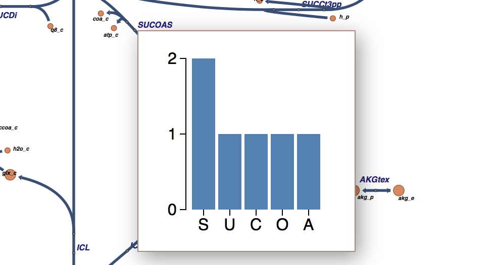
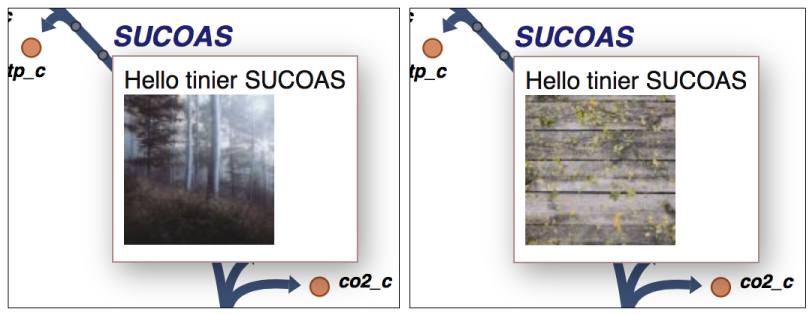

Developer Tutorial: Custom tooltips
-----------------------------------

We designed Escher to be easily extended by anyone willing to learn a little
JavaScript. A few extensions to Escher already exist; you can check out our
`demos`_ and see Escher in action on the `Protein Data Bank`_. Escher uses
standard web technologies (JavaScript, CSS, HTML, SVG), so you can embed it in
any web page. We also hope to see users extend the maps by integrating plots,
dynamic interactions, and more.

In this tutorial, I will introduce a new extension mechanism in Escher: custom
tooltips. The tooltips are already available on Escher maps when you hover over
a reaction, metabolite, or gene. The default tooltips provide some information
about the object you are hovering over, but any text, links, or pictures could
potentially be displayed there.

With a little bit of JavaScript, you can add your own content to the
tooltips. In this tutorial, we will add custom text, images, and then plots with
`D3.js`_ to the tooltips. Here's what were are building up to (`live demo`_):

To follow along with this tutorial, you will need a basic understanding of HTML,
CSS, JavaScript, and SVG. If you have never used these before, check out
`codecademy`_.

On the other hand, if you already know JavaScript and the basic Escher API, you
can skip to the section :ref:`custom-tooltips`.

Getting ready to develop with Escher
====================================

Before you can make any changes to an Escher map, you will download some source
code and set up a local web server. Your local version of Escher will have all
of the features from the main website, but you will be able to modify the
visualizations and add your own content. First we need to start up a basic
static file server.

NOTE: If you already have experience with JavaScript development, you might want
to download Escher from NPM (as ``escher``). If you like Webpack, check out
the `escher-test`_ repository.

To get started, download this `ZIP file`_. If you prefer to use **git** for version
control, you can also clone the `source code from GitHub`_.

Then, in your favorite terminal, navigate to into the folder (the one that
contains ``README.md``), and run one of the following commands to start a web
server. You will need to have Python or node.js installed first; if you don't
have either, read `get started with Python`_ first.

.. code-block:: shell

    # python 2
    python -c "import SimpleHTTPServer; m = SimpleHTTPServer.SimpleHTTPRequestHandler.extensions_map; m[''] = 'text/plain'; m.update(dict([(k, v + ';charset=UTF-8') for k, v in m.items()])); SimpleHTTPServer.test();"

    # python 3
    python -m http.server

    # node.js
    http-server -p 8000

Open http://localhost:8000/ to see the your web server in action. It should look
just like the site here: https://escher.github.io/escher-demo/.

Now, any changes you make to the code in that folder will be reflected next time
you refresh you browser! Try editing the file ``embedded_map_builder/index.html``,
then reload your web browser to see what you've changed.

You can see what's happening under the hood by opening your *developer tools*
(`Chrome`_, `Firefox`_) where you can debug your code and check for error
messages.

How does Escher work?
=====================

The starting point for an Escher map is the **Builder** class. When you create a
Builder, you pass in options that define how the map will render: what to
display, whether to allow editing, how to style the map, and more. These options
are documented in the :doc:`javascript_api`.

The most basic demo is in the folder ``embedded_map_builder``. Look for the
``main.js`` file that contains a section of JavaScript code that looks like
this:

.. code-block:: javascript

    d3.json('e_coli.iJO1366.central_metabolism.json', function (e, data) {
      if (e) console.warn(e);
      var options = { menu: 'all', fill_screen: true };
      var b = escher.Builder(data, null, null, d3.select('#map_container'), options);
    });

That code does three things. First, it uses D3 to load a file (the one that ends
in ``.json``) that contains the layout for a pathway map. Second, it defines
some options for the map. And third, it creates a new ``Builder``, passing in
the loaded data. Escher needs to know where to render the map, so the fourth
argument points to a location on the page (a DOM element) using D3. Check the
HTML in ``index.html`` and you will find the line ``

``. This is where the new Escher Builder will live.

To test your setup, change the ``menu`` option from ``all`` to ``zoom``, reload
the page, and see what happens.

Now you are ready to extend Escher!

.. _custom-tooltips:

Custom tooltips
===============

We've designed the tooltip customization process to be as easy and modular as
possible. The Builder will generate a ``div`` element to display your tooltip
whenever you mouse over a label or map object associated with a reaction or
metabolite.

Method 1: Tooltip with random pics
==================================

In the ``custom_tooltips`` directory, you'll find a JavaScript file called
``main.js`` that we will use to try out two examples of custom tooltips. The
first one, ``Tooltip1``, displays a random image from a web service called
unsplash when you hover over a metabolite label or reaction label:

To activate ``Tooltip1``, look for the following block of code at the end of
``main.js`` and change the variable ``Tooltip2`` to ``Tooltip1``:

.. code-block:: javascript

  var options = {
    menu: 'zoom',
    fill_screen: true,
    never_ask_before_quit: true,
    // --------------------------------------------------
    // CHANGE ME
    tooltip_component: Tooltip2
    // --------------------------------------------------

The open your browser to http://127.0.0.1:8080/custom_tooltips and hover over a
reaction or metabolite label to see it in action!

The tooltip is defined like this:

.. code-block:: javascript

  const Tooltip1 = props => {
    return (
      // Style the text based on our tooltip_style object
      h('div', { style: tooltipStyle},
        // Update the text to read out the identifier biggId
        'Hello tooltip world ' + props.biggId,
        // Line break
        h('br'),
        // Add a picture. Get a random pic from unsplash, with ID between 0 and 1000.
        h('img', { src: 'https://unsplash.it/100/100?image=' +  Math.floor(Math.random() * 1000) })
      )
    );
  };

Each tooltip receives data from Escher as an data structure called ``props``.
The props include these attributes:

- biggId: The ID for the reaction, metabolite, or gene.
- name: The display name for the reaction, metabolite, or gene.
- loc: The coordinates of the tooltip.
- data: Any loaded data associated with the reaction, metabolite, or gene.
- type: The type of element ("reaction", "metabolite", or "gene")

Escher uses the `Preact`_ library to define tooltips. Preact provides the ``h``
function which specifies the HTML element to create and any attributes and
children (or you can use JSX if you already know how to set it up). Preact is a
variant of the popular `React`_ web framework, and there are many resources
available for learning more about it. We recommend this course:

https://www.codecademy.com/learn/react-101

Anything you can do with Preact, you can do in tooltip!

Method 2: Tooltip with a D3 plot
================================

What if we want a data plot in the tooltip? `D3.js`_ is great for creating
custom plots, so let's start with this example of a bar plot in D3.

D3 takes a little while to learn, so, if you are interested in expanding on what
we show here, I recommend you read through some D3 `tutorials`_. I will only
explain the main points here, and you can work through the details as you learn
D3.

The complete code for ``Tooltip2`` with bar charts is in
``custom_tooltips/main.js``. To see it in action, change the tooltip_component
back too ``Tooltip2`` (i.e. undo the changes you made in the last section) and
refresh the demo website.

The new Tooltip also uses Preact to define how it will render, but the Tooltip
is now defined as a Preact Component class:

.. code-block:: javascript

  class Tooltip2 extends Component {
    componentShouldUpdate() {
      return false;
    }
    ...

This component tells Preact to create a div by defining this ``render`` function:

.. code-block:: javascript

    render() {
      // Style the text based on our tooltip_style object
      return h('div', { style: tooltipStyle });
    }

But the rest of the work is deferred to the D3 code in
``componentWillReceiveProps``. To make sure Preact and D3 play nicely, it is
essential to return ``false`` from ``componentShouldUpdate``.

With these pieces in place, the rest of the code defines the particular plot we
will make. Most of the content of ``componentWillReceiveProps`` should look like
the D3 example here:

https://bl.ocks.org/mbostock/3310560

There is also a helper function to take the BiGG ID for our reaction,
metabolite, or gene and calculate the frequency of each letter:

.. code-block:: javascript

  function calculateLetterFrequency (s) {
    var counts = {}
    s.toUpperCase().split('').map(function (c) {
      if (!(c in counts)) {
        counts[c] = 1
      } else {
        counts[c] += 1
      }
    })
    return Object.keys(counts).map(function (k) {
      return { letter: k, frequency: counts[k] }
    })
  }

The end result looks like this:

Pretty cool! This is also the version that's live on the `demo website`_, so you
can see it in action there as well.

With these tools, you should have what you need to build complex, custom
features on top of Escher. To see what's possible, check out Escher-FBA which
was built using this exact API:

https://sbrg.github.io/escher-fba

Happy extending!

.. _`demos`: https://github.com/escher/escher-demo
.. _`Protein Data Bank`: http://www.rcsb.org/pdb/secondary.do?p=v2/secondary/visualize.jsp#visualize_pathway
.. _`example gallery`: https://github.com/d3/d3/wiki/Gallery
.. _`get started with Python`: https://www.python.org/about/gettingstarted/
.. _`D3.js`: https://d3js.org
.. _`codecademy`: https://www.codecademy.com
.. _`source code from GitHub`: https://github.com/escher/escher-demo
.. _`escher-test`: https://github.com/escher/escher-test
.. _`ZIP file`: https://github.com/escher/escher-demo/archive/master.zip
.. _`Chrome`: https://developer.chrome.com/devtools
.. _`Firefox`: https://developer.mozilla.org/en-US/docs/Tools
.. _`React`: https://reactjs.org/
.. _`Preact`: https://preactjs.com/
.. _`tutorials`: https://github.com/d3/d3/wiki/Tutorials
.. _`demo website`: http://escher.github.io/escher-demo/custom_tooltips/
.. _`live demo`: http://escher.github.io/escher-demo/custom_tooltips/
