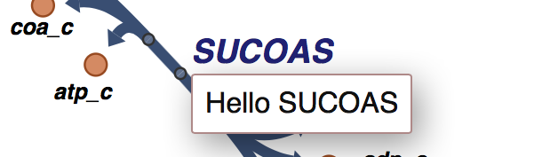
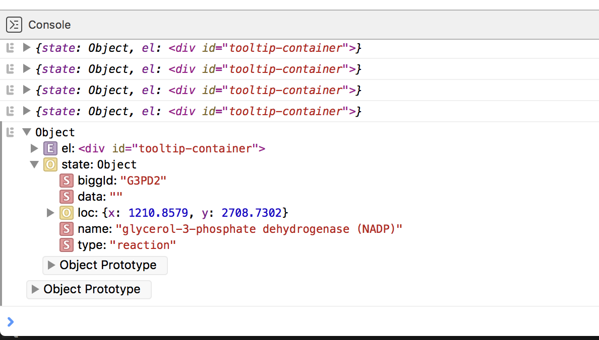

Tutorial: Custom tooltips
-------------------------

We designed Escher to be easily extended by anyone willing to learn a little
JavaScript. A few extensions to Escher already exist; you can check out our
`demos`_ and see Escher in action on the `Protein Data Bank`_ for
examples. Escher uses standard web technologies (JavaScript, CSS, HTML, SVG), so
you can embed it in any web page. We also hope to see users extend the maps by
integrating plots, dynamic interactions, and more.

In this tutorial, I will introduce a new extension mechanism in Escher: custom
tooltips. The tooltips are already available on Escher maps when you hover over
a reaction, metabolite, or gene. The default tooltips provide some information
about the object you are hovering over, but any text, links, or pictures could
potentially be displayed there.

With a little bit of JavaScript, you can add your own content to the
tooltips. This could be custom text, images, or plots or anything else possible
in a website. We use `D3.js`_ for many plots, and, while D3.js is optional here,
you might want to check out their `example gallery`_ for inspiration.

To follow along with this tutorial, you will need a basic understanding of HTML,
CSS, JavaScript, and SVG. If you have never used these before, check out
`codecademy`_.

On the other hand, if you already know JavaScript and the basic Escher API, you
can skip to section :ref:`custom-tooltips`.

Getting ready to develop with Escher
====================================

Before you can make any changes to an Escher map, you will download some source
code and set up a local web server. Your local version of Escher will have all
of the features from the main website, but you will be able to modify the
visualizations and add your own content. First we need to start up a basic
static file server.

NOTE: If you already have experience with JavaScript development, you might want
to download Escher from NPM (as ``escher-vis``). If you like Webpack, check out
the `escher-test`_ repository.

To get started, download this `ZIP file`_. If you prefer to use **git** for version
control, you can also clone the `source code from GitHub`_.

Then, in your favorite terminal, navigate to into the folder (the one that
contains ``README.md``), and run one of the following commands to start a web
server. You will need to have Python or node.js installed first; if you don't
have either, `get started with Python`_ first.

.. code-block:: shell

    # python 2
    python -c "import SimpleHTTPServer; m = SimpleHTTPServer.SimpleHTTPRequestHandler.extensions_map; m[''] = 'text/plain'; m.update(dict([(k, v + ';charset=UTF-8') for k, v in m.items()])); SimpleHTTPServer.test();"

    # python 3
    python -m http.server

    # node.js
    http-server -p 8000

Open http://localhost:8000/ to see the your web server in action. It should look
just like the site here: https://escher.github.io/escher-demo/.

Now, any changes you make to the code in that folder will be reflected next time
you refresh you browser! Try editing the file ``embedded_map_builder/index.html``,
then reload your web browser to see what you've changed.

You can see what's happening under the hood by opening your *developer tools*
(`Chrome`_, `Firefox`_) where you can debug your code and check for error
messages.

How does Escher work?
=====================

The starting point for an Escher map is the **Builder** class. When you create a
Builder, you pass in options that define how the map will render: what to
display, whether to allow editing, how to style the map, and more. These options
are documented in the :doc:`javascript_api`.

The most basic demo is in the folder ``embedded_map_builder``. Look for the
``index.html`` file that contains a section of JavaScript code that looks like
this:

.. code-block:: javascript

    d3.json('e_coli.iJO1366.central_metabolism.json', function (e, data) {
      if (e) console.warn(e);
      var options = { menu: 'all', fill_screen: true };
      var b = escher.Builder(data, null, null, d3.select('#map_container'), options);
    });

That code does three things. First, it uses D3 to load a file (the one that ends
in ``.json``) that contains the layout for a pathway map. Second, it defines
some options for the map. And third, it creates a new ``Builder``, passing in
the loaded data. Escher needs to know where to render the map, so the fourth
argument points to a location on the page (a DOM element) using D3. Check the
HTML in ``index.html`` and you will find the line ``

``. This is where Escher lives.

To test your setup, change the ``menu`` option from ``all`` to ``zoom``, reload
the page, and see what happens.

Now you are ready to extend Escher!

.. _custom-tooltips:

Custom tooltips
===============

We are going to modify the Escher tooltips, first with simple text, and then
with some pictures and plots. We will start with the code in the folder
``custom_tooltips``, and you should already be able to see the output at
http://localhost:8000/custom_tooltips.

Method 1: Callback function
===========================

The simplest tooltip is just a function that Escher will call whenever a user
pilots the mouse over a metabolite, reaction, or gene. In the ``index.html`` for
``custom_tooltips``, we can set our tooltip function with the ``tooltip_component``
option.

.. code-block:: javascript

  var options = {
    menu: 'zoom',
    fill_screen: true,
    // --------------------------------------------------
    // CHANGE ME
    tooltip_component: tooltips_1,
    // --------------------------------------------------
  }

That tooltip ``tooltip2_1`` is a function that we defined earlier in
``index.html``. Here's what it looks like:

.. code-block:: javascript

  var tooltips_1 = function (args) {
    if (args.el.childNodes.length === 0) {
      var node = document.createTextNode('Hello ')
      args.el.appendChild(node)
      Object.keys(tooltip_style).map(function (key) {
        args.el.style[key] = tooltip_style[key]
      })
    }
    args.el.childNodes[0].textContent = 'Hello ' + args.state.biggId
  }

And when you hover over a reaction on the page, you will see this:

The function looks a little complicated, but what we are doing is extremely
simple. The first thing to look at is that ``args`` object. Escher gives you all
the data you need to render your tooltips through ``args``. Try adding this line
to the function and reloading:

.. code-block:: javascript

  var tooltips_1 = function (args) {
    console.log(args) // NEW
    if (args.el.childNodes.length === 0) {

Now, open your developer tools when you hover, and you can see exactly what
we're working with. After you hover a few times, the console should contain
something like this:

So there you have it! Escher passes you ``args.el``, the location on the page
(DOM element) inside the active tooltip, and ``args.state``, an object with
details about the element you just hovered over.

The rest of the tooltip function takes ``el`` and adds some text to it. Browsers
contain some built-in functions like ``document.createTextNode`` for modifying
the page, and with a little reading on `MDN`_, you can probably make sense of
it. But there is a better way! Because these built-in methods are long and
boring, we created a some shortcuts for this kind of basic DOM manipulation, and
that's what the next section is all about.

Method 2: Callback function with Tinier for rendering
=====================================================

`Tinier`_

Here is the code.

.. code-block:: javascript

     var tooltips_2 = function (args) {
       tinier.render(
         args.el,
         tinier.createElement(
           'div', { style: tooltip_style},
           'Hello tinier ' + args.state.biggId
         )
       )
     }

In place of Tinier, you could also use a library like JQuery here.

Method 3: Tinier Component with state
=====================================

Here is the code.

.. code-block:: javascript

     var tooltips_3 = tinier.createComponent({
       init: function () {
         return {
           biggId: '',
           name: '',
           loc: { x: 0, y: 0 },
           data: null,
           type: null,
           // custom data
           count: 0,
         }
       },

       reducers: {
         setContainerData: function (args) {
           return Object.assign({}, args.state, {
             biggId: args.biggId,
             name: args.name,
             loc: args.loc,
             data: args.data,
             type: args.type,
             count: args.state.count + 1,
           })
         },
       },

       render: function (args) {
         tinier.render(
           args.el,
           tinier.createElement(
             'div', { style: tooltip_style },
             'Hello tinier ' + args.state.biggId + ' ' + args.state.count
           )
         )
       }
     })

state === memory

.. _`Tinier`: https://github.com/zakandrewking/tinier
.. _`demos`: https://escher.github.io/escher-demo
.. _`Protein Data Bank`: http://www.rcsb.org/pdb/secondary.do?p=v2/secondary/visualize.jsp#visualize_pathway
.. _`example gallery`: https://github.com/d3/d3/wiki/Gallery
.. _`get started with Python`: https://www.python.org/about/gettingstarted/
.. _`D3.js`: https://d3js.org
.. _`codecademy`: https://www.codecademy.com
.. _`source code from GitHub`: https://github.com/escher/escher-demo
.. _`escher-test`: https://github.com/escher/escher-test
.. _`ZIP file`: https://github.com/escher/escher-demo/archive/master.zip
.. _`Chrome`: https://developer.chrome.com/devtools
.. _`Firefox`: https://developer.mozilla.org/en-US/docs/Tools
.. _`MDN`: https://developer.mozilla.org/
