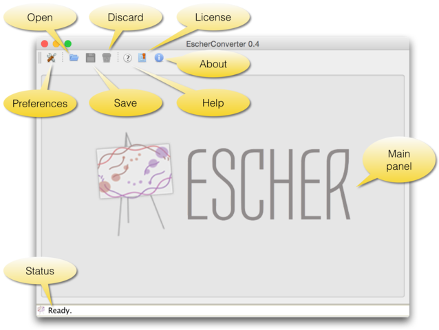
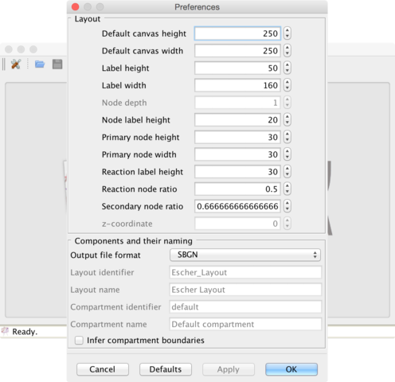
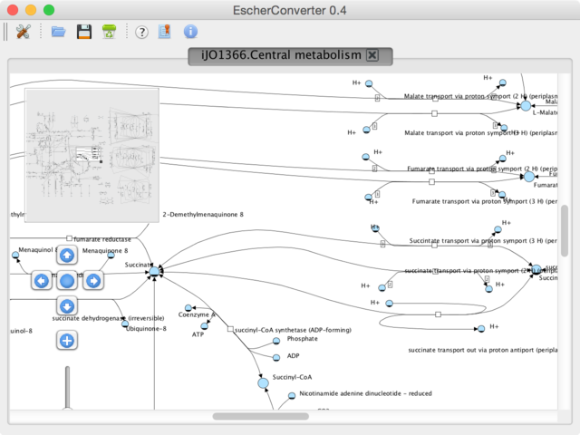

***************
EscherConverter
***************

EscherConverter is a standalone program that reads files created with the
graphical network editor Escher and converts them to files in community standard
formats.

.. image:: _static/escherconverter_io.png

Download `EscherConverter 1.2`_ (20.3 MB).

Using EscherConverter
=====================

Escher uses a JSON file format to represent its networks. This format has been
developed because of its very small file size and its compatibility to online
programs that are written in JavaScript. In particular, JSON is a JavaScript
Object Notation, or in other words, a JSON file directly represents components
of JavaScript programs. This makes parsing very simple and allows direct use of
those files in web-based programs.

However, in systems biology, specific file formats have been developed with the
aim to be easily exchangeable between software implemented in diverse
programming languages.

To this end, these formats support semantically clear annotations and are
maintained by a large community of scientists. EscherConverter supports export
to two particularly important XML-based community file formats SBML with layout
extension and SBGN-ML.

While SBML has been mainly developed for dynamic simulation of biological
networks, it is nowadays also usable for diverse other purposes. Its layout
extension facilitates the encoding the display of biological networks.

SBGN-ML has been directly developed as a language for the display of biological
pathway maps of diverse kinds. It stores the position and connection of
entities, similar to what is shown in Escher networks.

EscherConverter takes Escher's JSON files as input and generates equivalent SBML
Level 3 Version 1 files with layout extension or SBGN-ML files.

In order to ensure that the conversion is correct, EscherConverter provides its
own display that gives users a preview of how the export data format will be
rendered by other tools. In this preview display, you can zoom in and out, move
arcs and node positions.  However, it is important to know that none of the
changes made in this preview are stored in the export file.

Download and Installation
-------------------------

You can obtain local copy of EscherConverter by clicking here_.

As a Java™ application, no specific installation is required for
EscherConverter.

However, make sure you have a recent Java™ Runtime Environment (JRE) installed
on your computer (at least JRE 8).  You can obtain Java™ from the Oracle
website.  There you can also find installation instructions for your respective
operating system.

Once Java™ has been installed, you can simply place the EscherConverter JAR file
somewhere on your local computer, for instance in the folder

- ``/Applications/`` if you are working under Mac OS
- ``/opt/`` for Linux computers
- ``C:\Program Files\`` if you are using Windows

Launching the program
---------------------

You can launch EscherConverter simply by double-clicking on the application JAR
file. This will open a following graphical user interface as described in the
following figures.

Figure 1 | The graphical user interface of EscherConverter.

- Preferences: opens a settings dialog (see next screenshot).
- Open: displays a file chooser to select an input file in JSON format.
- Save: export the map that is displayed in the current tab to SBML or SBGN-ML.
- Discard: closes the current tab without saving.
- Help: opens the online help that displays all command-line options.
- License: displays the license under which this software is distributed.
- About: shows information about the authors of this software.
- Main: the main panel of the software, in which converted Escher maps will be displayed, organized in tabs.
- Status: the status bar shows information and logging messages during the conversion.

Figure 2 | The preferences dialog. All settings in this dialog are also available through EscherConverter's command-line interface.

Layout section: several properties that are required in SBML and SBGN-ML are not
explicitly specified in Escher's JSON format and therefore need to be adjusted
by the user. These are the size of the drawing canvas, the default box size for
text labels, the size of primary and secondary nodes. In contrast to SBGN-ML and
Escher's JSON format, the SBML layout extension supports three-dimensional
displays. When selecting this export file format, it is therefore necessary to
also define the z-coordinate and the depth of all objects.

Components and naming section: Most settings in this section are specific for
the SBML layout extension and are only active if this output format is
selected. These are names and identifiers of the layout component and the, in
case of SBML, mandatory default compartment (a compartment without physical
meaning, a reaction space in which all metabolites are located). EscherConverter
can infer compartment bounds from metabolites, but this is an experimental
feature. Just try it and see how the preview changes.

Figure 3 | A layout preview.

The birds-eye view and the navigation component on the left help you navigate
through the network display. This graph shows you how the converted pathway map
will be rendered by software that supports SBGN-ML or the SBML layout
extension. This preview can be modified by moving arcs or nodes, however, none
of those changes are stored when exporting the file. In this current version,
EscherConver only exports layouts as given in the original JSON file.

Included third-party software
-----------------------------

EscherConverter includes several third-party libraries, which we here list and
acknowledge:

- ArgParser
- JSBML
- libSBGN
- Pixel-Mixer icons
- yFiles

Command-line interface API
==========================

You can launch EscherConverter from the command-line. On a Unix system (such as
Linux, MacOS, or Solaris, etc.), use a command like::

  bash$ java -jar -Xms8G -Xmx8G -Duser.language=en ./EscherConverter-1.2.jar [options]

Under Window, use a command like::

  C:\> javaw -jar -Xms8G -Xmx8G -Duser.language=en EscherConverter-1.2.jar [options]

Escher has a large collection of command-line options (see below), which can be
useful if you want to launch the program with specific settings or if multiple
files are to be converted in a batch mode. It is even possible to completely
disable the graphical user interface.

Input and output files
----------------------

Definition of input and output data files as well as the format for the output.

::

   --input=<File>

Specifies the JSON input file. If a directory is given, the conversion will be
recursively performed. Accepts JSON.

::

  --output=<File>

The path to the file into which the output should be written. If the input is a
directory, this must also be a directory in order to perform a recursive
conversion. Accepts SBML, SBGN.

Escher layout
-------------

The options in this group allow you to influence how large certain elements
should be displayed.

::

  --canvas-default-height=<Double>

Just as in the case of the width of the canvas, this value needs to be specified
for cases where the JSON input file lacks an explicit specification of the
canvas height. Arguments must fit into the range {[1,1E9]}. (Default value: 250.0)

::

  --canvas-default-width=<Double>

This value is used when no width has been defined for the canvas.  Since the
width attribute is mandatory for the layout, a default value must be provided in
these cases. Arguments must fit into the range {[1,1E9]}. (Default value: 250.0)

::

  --label-height=<Double>

With this option you can specify the height of the bounding box of text
labels. Arguments must fit into the range {[1,1E9]}. (Default value: 50.0)

::

  --label-width=<Double>

This option defines the width of bounding boxes for text labels. Arguments must
fit into the range {[1,1E9]}. (Default value: 160.0)

::

  --node-depth=<Double>

The length of nodes along z-coordinate. Escher maps are actually
two-dimensional, but in general, a layout can be three-dimensional.  This value
should be an arbitrary value greater than zero, because some rendering engines
might not display the node if its depth is zero. Arguments must fit into the
range {[1,1E9]}. (Default value: 1.0)

::

  --node-label-height=<Double>

Node labels can have a size different from general labels in the graph. Here you
can specify how height the bounding box of the labels for nodes should
be. Arguments must fit into the range {[1,1E9]}. (Default value: 20.0)

::

  --primary-node-height=<Double>

The primary node should be bigger than the secondary node. With this option you
can specify the height of this type of nodes. Arguments must fit into the range
{[1,1E9]}. (Default value: 30.0)

::

  --primary-node-width=<Double>

Escher maps distinguish between primary and secondary nodes. Primary nodes
should be larger than secondary nodes and display the main flow of matter
through the network. This option allows you to specify the width of primary
nodes. Arguments must fit into the range {[1,1E9]}. (Default value: 30.0)

::

  --reaction-label-height=<Double>

Reaction label heightArguments must fit into the range {[1,1E9]}. (Default
value: 30.0)

::

  --reaction-node-ratio=<Double>

This value is used as a conversion factor to determine the size of the reaction
display box depending on the size of primary nodes.  Height and width of
reaction nodes are determined by dividing the corresponding values from the
primary node size by this factor. Arguments must fit into the range
{[0,1]}. (Default value: 0.5)

::

  --secondary-node-ratio=<Double>

Similar to the reaction node ratio, the size of secondary nodes (width and
height) is determined by dividing the corresponding values from the primary
nodes by this value. Arguments must fit into the range {[0,1]}. (Default value:
0.6666666666666666)

::

  --z=<Double>

The position on the z-axis where the entire two-dimensional graph should be
drawn. Arguments must fit into the range {[-1E9,1E9]}. (Default value: 0.0)

Escher Components and their naming
----------------------------------

Here you can influence, which elements are to be included in the layout and how
elements in the layout are to be called or identified.

::

  --format=<OutputFormat>

The desired format for the conversion, e.g., SBML. All possible values for type
<OutputFormat> are: SBGN and SBML. (Default value: SBML)

::

  --layout-id=<String>

In contrast to the name, this identifier does not have to be
human-readable. This is a machine identifier, which must start with a letter or
underscore and can only contain ASCII characters. (Default value: Escher_Layout)

::

  --layout-name=<String>

This should be a human-readable name for the layout that is to be created. This
name might be displayed to describe the figure and should therefore be
explanatory. (Default value: Escher Layout)

::

  --compartment-id=<String>

A compartment needs to have a unique identifier, which needs to be a
machine-readable Sting that must start with a letter or underscore and can only
contain ASCII characters. Since the JSON file does not provide this information,
this option allows you to specify the required identifier. (Default value: default)

::

  --compartment-name=<String>

With this option it is possible to define a name for the default compartment can
be that needs to be generated for the conversion to SBML. The name does not have
any restrictions, i.e., any UTF-8 character can be used. (Default value: Default
compartment)

::

  --infer-compartment-bounds

This converter can infer where the boundaries of compartments could be drawn. To
this end, it uses each node's BiGG ids to identify the compartment of all
metabolites. Assuming that compartments have rectangular shapes, the algorithm
can find the outermost node on each side of the box and hence obtain the
boundaries of the compartment. However, this methods will fail when metabolites
are drawn inside of such a box that belong to a different compartment that is
actually further outside. For this reason, this option is deactivated by
default. (Default value: false)

Options for the graphical user interface
----------------------------------------

::

  --gui

If this option is given, the program will display its graphical user
interface. (Default value: false)

::

  --log-level=<String>

Change the log-level of this application. This option will influence how
fine-grained error and other log messages will be that you receive while
executing this program. All possible values for type <String> are: ALL, CONFIG,
FINE, FINER, FINEST, INFO, OFF, SEVERE, and WARNING. (Default value: INFO)

::

  --log-file=<File>

This option allows you to specify a log file to which all information of the
program will be written. Accepts (*.bp2, *.bp3, *.log, *.owl, *.xml).

.. _here: https://github.com/SBRG/EscherConverter/releases/download/1.2/EscherConverter-1.2.0.jar
.. _`EscherConverter 1.2`: here_
