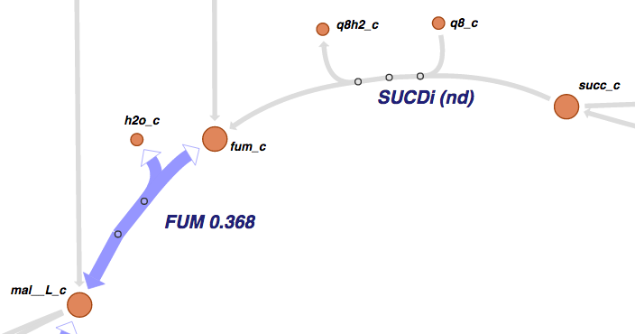
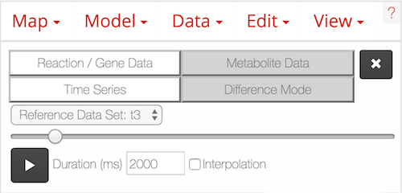
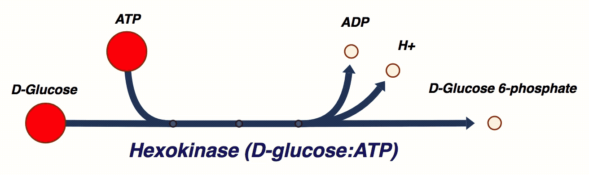
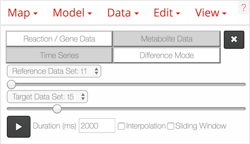
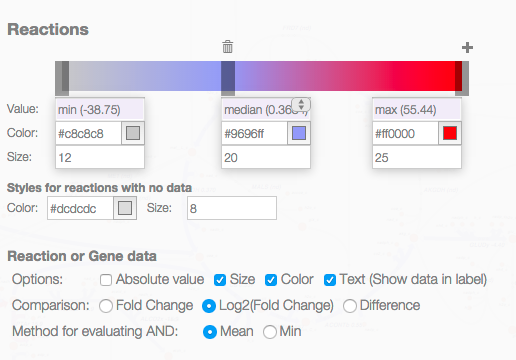

Getting started
---------------

Introduction
============

**Escher** is here to help you visualize pathway maps. But, if you have never
heard of a pathway map, you might appreciate a quick introduction.

What are pathway maps?
^^^^^^^^^^^^^^^^^^^^^^

To understand pathway maps, it is useful to think about the general organization
of a cell. At the smallest level, molecules in a cell are arranged in
three-dimensional structures, and these structures determine many of the
functions that take place in a cell. For example, the 3D structure of an enzyme
determines the biochemical reactions that it can catalyze. These structures can
be visualized in 3D using tools like `Jmol`_ (as in this `example structure`_).

The DNA sequence is a second fundamental level of biological organization. DNA
sequences are the blueprints for all the machinery of the cell, and they can be
visualized as a one-dimensional series of bases (ATCG) using tools like the
`UCSC genome browser`_.

To use a football analogy, the 3D molecular structures are akin to the players
on the field, and the information in the DNA sequence is like the playbook on
the sidelines. But, football would not be very interesting if the players never
took to the field and executed those plays. So, we are missing this level of
detail: *the execution of biological plans by the molecular players*.

What we are missing is the biochemical reaction network. Proteins in the cell
catalyze the conversion of substrate molecules into product molecules, and these
*reactions* are responsible for generating energy, constructing cellular machinery
and structures, detecting molecules in the environment, signaling, and
more. Biochemical reactions can be grouped into pathways when they work in
concert to carry out a function. (If a reaction is a football play, then the
pathway is a `drive`_). And Escher can be used to visualize these reactions and
pathways. Together, we call these visualizations **pathway maps**.

Escher to the rescue
^^^^^^^^^^^^^^^^^^^^

Many Escher maps represent *metabolic* pathways, and Escher was developed at the
`Systems Biology Research Group`_ where we have been building genome-scale
models of metabolism over the past fifteen years. However, Escher is not limited to
metabolism: It can be used to visualize any collection of biochemical reactions.

Escher includes one more killer feature: The ability to visualize datasets on a
pathway map. Many biological discoveries are enabled by collecting and analyzing
enormous datsets, and so biologists are grappling with the challenges of *big
data*. By visualizing data in the context of pathway maps, we can quickly spot
trends which would not be apparent with standard statistical tools. And Escher
visualizations can be adapted and shared to demonstrate those biological
discoveries.

The rest of this guide will introduce the Escher user interface and the major
features of Escher.

The launch page
===============

When you open the Escher `website`_, you will see a launch page that looks like
this:

.. image:: _static/launch_page.png

The options on the launch page are:

- **Filter by organism:** Choose an organism to filter the Maps and Models.
- **Map:** Choose a pre-built map, or start from scratch with an empty builder by
  choosing **None**. In parentheses next to the map name, you will see the name of
  the model that was used to build this map.
- **Model:** (Optional) If you choose a COBRA model to load, then you can add new
  reactions to the pathway map. You can also load your own model later, after
  you launch the tool. For an explanation of maps, models, and COBRA, see
  :doc:`escher_and_cobrapy`.
- **Tool:**

    - The **Viewer** allows you to pan and zoom the map, and to visualize data for
      reactions, genes, and metabolites.
    - The **Builder**, in addition to the Viewer features, allows you to add
      reactions, move and rotate existing reactions, add text annotations, and
      adjust the map canvas.

- **Options:**

    - **Scroll to zoom (instead of scroll to pan)**: Determines the effect of using
      the mouse's scroll wheel over the map.
    - **Never ask before reloading**: If this is checked, then you will not be
      warned before leaving the page, even if you have unsaved changes.

Choose **Load map** to open the Escher viewer or builder in a new tab, and
prepare to be delighted by your very own pathway map.

The menu bar
============

Once you have loaded an Escher map, you will see a menu bar along the top of the
screen. Click the question mark to bring up the Escher documentation:

.. image:: _static/menu.png

Loading and saving maps
=======================

Using the map menu, you can load and save maps at any time:

.. image:: _static/map_menu.png

Click **Save map JSON** to save the Escher map as a JSON file, which is the
standard file representing an Escher map.

**NOTE**: The JSON file does NOT save any datasets you have loaded. This may be
changed in a future version of Escher.

**NOTE 2**: In Safari, saving files from Escher works a little differently than
in the other major browsers. After clicking **Save map JSON**, Safari will load
a new tab with the raw content of the Escher map file. To save the file, choose
File>Save As... from the Safari menu. A new dialog appears; in the dropdown menu
near the bottom, select Page Source (rather than Web Archive), give your file an
appropriate name (e.g. ``map.json`` for an Escher map or ``map.svg`` for an SVG
export), and click Save.

Later, you can can load a JSON file to view and edit a map by clicking **Load map
JSON**.

Click **Export as SVG** to generate a `SVG`_ file for editing in tools like
`Adobe Illustrator`_ and `Inkscape`_. This is the best way to generate figures
for presentations and publications. Unlike a JSON file, a SVG file maintains the
data visualizations on the Escher map. However, you cannot load SVG files into
Escher after you generate them.

Click **Clear Map** to empty the whole map, leaving a blank canvas. **NOTE**: You
cannot undo **Clear Map**.

Loading models
==============

Use the model menu to manage the COBRA model loaded in Escher:

.. image:: _static/model_menu.png

Choose **Load COBRA model JSON** to open a COBRA model. Read more about COBRA
models in :doc:`escher_and_cobrapy`. Once you have COBRApy v0.3.0 or later
installed, then you can generate a JSON model by following this `example code`_.

Once you have loaded a COBRA model, there may be inconsistencies between the
content in the map and the model (e.g. reaction IDs, descriptive names and gene
reaction rules). You click **Update names and gene reaction rules using model**
to find matching reactions and metabolites between the map and the model (based
on their IDs) and then apply the names and gene reaction rules from the model to
the map. The reactions that do not match will be highlighted in red. (This can
be turned off again in the settings menu by deselecting *Highlight reactions not
in model*.)  More advice on building maps is available in
:doc:`contribute_maps`.

Click **Clear Model** to clear the current model.

.. _loading-reaction-gene-and-metabolite-data:

Loading reaction, gene, and metabolite data
============================================

Datasets can be loaded as CSV files or JSON files, using the Data Menu.

.. image:: _static/data_menu_02.png

In Escher, reaction and gene datasets are visualized by changing the color,
thickness, and labels of reaction arrows. Metabolite datasets are visualized by
changing the color, size, and labels of metabolite circles. The specific
visual styles can be modified in the :ref:`settings` menu. When data is not
present for a specific reaction, gene, or metabolite, then the text label will
say 'nd' which means 'no data.'

Time Series Mode and Difference Mode
^^^^^^^^^^^^^^^^^^^^^^^^^^^^^^^^^^^^

If you have loaded a file set containing more than one data set
you can choose which one to visualize by choosing **Time Series Mode / Difference Mode**
in the Data Menu.
This allows access to an interface below the menu bar.
The two buttons on top are to choose if reaction, respectively gene data, or metabolite data is handled.
The next buttons are for choosing between **Time Series Mode** and **Difference Mode** .

**Time Series Mode**

To select a data set to visualize **Time Series Mode** shows a slider and drop-down menu,
which also shows the selected data set name.

By pressing the play button you can visualize your data in a video-like animation.
The slider moves as a indicator which data set is currently displayed.
The duration of the whole animation can be set in the input field.
If the “Interpolation” check box is activated, a smoother animation with interpolation is created.

**Difference Mode**

In Difference Mode a second slider and drop-down menu are added to the interface for setting a target data set.
This target data set is used for comparison to the reference according to the function set in the settings.

**Difference Mode Animation**

By pressing the play button the reference data set remains static, the target moves one step at a time in the animation.
The difference value between the data points according to the setting is visualized.
::

    reference: [0] 1  2  3
    target:     0 [1] 2  3
    ----
    reference: [0] 1  2  3
    target:     0  1 [2] 3
    ----
    reference: [0] 1  2  3
    target:     0  1  2 [3]

**Sliding Window Animation**

Reference and target data set move one step at a time.
::

    reference: [0] 1  2  3
    target:     0 [1] 2  3
    ----
    reference:  0 [1] 2  3
    target:     0  1 [2] 3
    ----
    reference:  0  1 [2] 3
    target:     0  1  2 [3]

Example data files
^^^^^^^^^^^^^^^^^^

It is often easiest to learn by example, so here are some example datasets that
work with Escher maps for the *Escherichia coli* model iJO1366:

**Reaction data**

- `S3_iJO1366_anaerobic_FBA_flux.json`_: FBA flux simulation data for iJO1366 as JSON.
- `reaction_data_iJO1366.json`_: A JSON file with one dataset of fluxes.
- `reaction_data_diff_iJO1366.json`_: A JSON file with two dataset of fluxes.
- `reaction_data_example`_: A JSON file with more than two datasets.
- `reaction_data_example_names`_: A JSON file with example data names.
- `reaction_data_time_series_example_names`_: A JSON file with a time series mock-up.
- `reaction_data_time_series_example_time_values`_: A JSON file with a non-linear time series.
- `example_in_csv`_: A example file of reaction data in CSV format.

**Metabolite data**

- `S4_McCloskey2013_aerobic_metabolomics.csv`_: Aerobic metabolomics for E. coli as CSV.
- `metabolite_data_iJO1366.json`_: A JSON file with one dataset of metabolite
  concentrations.
- `metabolite_data_diff_iJO1366.json`_: A JSON file with two datasets of
  metabolite concentrations.
- `metabolite_data_example`_: A JSON file example with more than two datasets.
- `metabolite_data_example_names`_: A JSON file example with more than two datasets with dataset names.

**Gene data**

- `S6_RNA-seq_aerobic_to_anaerobic.csv`_: Comparison of two gene datasets
  (RNA-seq) as CSV.
- `gene_data_names_iJO1366.json`_: A single gene dataset using descriptive
  (gene) names for identifiers as JSON.
- `gene_data_example`_: A JSON file example with more than two datasets.
- `gene_data_example_names`_: A JSON file example with more than two datasets with dataset names.

Creating data files as CSV and JSON
^^^^^^^^^^^^^^^^^^^^^^^^^^^^^^^^^^^

CSV files should have 1 header row, 1 ID column followed by columns for
data values.
The header row can contain names for the data sets like experimental conditions or time points.
The ID column can contain BiGG IDs or descriptive names for the
reactions, metabolites, or genes in the dataset. Here is an example with a
single data value columns::

    ID,time 0sec
    glc__D_c,5.4
    g6p__D_c,2.3

Which might look like this is Excel:

========= =========
ID        time 0sec
========= =========
glc__D_c  5.4
g6p_c     2.3
========= =========

Escher is able to process as many data sets as needed. For more data sets just add more columns for data values.
If two or more datasets are provided, then the Escher map can display the difference
between the datasets in **Difference Mode**. On default the first one is displayed.
With the slider or drop-down menus you can choose which ones to compare by setting first a reference, then a target set.
In the Settings menu, the **Comparison** setting allows
you to choose between comparison functions (Fold Change, Log2(Fold Change), and
Difference). With three datasets, the CSV file looks like this:

========= ========== ========= =========
ID        set 1      set 2     set 3
========= ========== ========= =========
glc__D_c  5.4        10.2      20.3
g6p_c     2.3        8.1       9.2
========= ========== ========= =========

Or in JSON like this:
::

    [ [ "data_set_1", "data_set_2", "data_set_3" ],
      [ {"PPA2":0.1, "ENO": 0.0, "PPS": 0.2},
        {"PPA2":0.5, "ENO": 0.7, "PPS": 1.2 },
        {"PPA2":1.1, "ENO": 1.2, "PPS": 0.2}   ] ]

Important is that the file contains two arrays.
First one containing name of datasets, the other is an array of dictionaries with identifier and data values.
A JSON schema can be  :download:`downloaded here <../jsonschema/dataschema>`.

..
   For gene data, an example file could contain the BiGG IDs (generally the locus
   IDs) or the descriptive names (generally gene names). So, for the RECON1 human
   model, the following gene data files would be equivalent:

       ID,reads
       glc__D_c,1220
       g6p__D_c,35

       descriptive name,reads
       glc__D_c,1220
       g6p__D_c,35

Data can also be loaded from a JSON file. This Python code snippet provides an
example of generating the proper format for single reaction data values and for
reaction data comparisons::

    import json

    # save a single flux vector as JSON
    flux_dictionary = {'glc__D_c': 5.4, 'g6p_c': 2.3}
    with open('out.json', 'w') as f:
	json.dump(flux_dictionary, f)

    # save a flux comparison as JSON
    flux_comp = [{'glc__D_c': 5.4, 'g6p_c': 2.3}, {'glc__D_c': 10.2, 'g6p_c': 8.1}]
    with open('out_comp.json', 'w') as f:
	json.dump(flux_comp, f)

**Specifying non-linear time scale**

Escher is able to read dataset names as specific time points. If the names start with a 't' and are followed only by a
number Escher is able to process data in a non-linear time scale. This can look like this:

========= ========== ========= =========
ID        t1         t5        t7
========= ========== ========= =========
glc__D_c  5.4        10.2      20.3
g6p_c     2.3        8.1       10.2
========= ========== ========= =========

.. _gene-reaction-rules:

Gene data and gene reaction rules
^^^^^^^^^^^^^^^^^^^^^^^^^^^^^^^^^

Escher uses *gene reaction rules* to connect gene data to the reactions on a
metabolic pathway. You can see these gene reaction rules on the map by selecting
*Show gene reaction rules* in the :ref:`settings` menu.

Gene reaction rules show the genes whose gene products are required to catalyze
a reaction. Gene are connected using AND and OR rules. AND rules are
used when two genes are required for enzymatic activity, e.g. they are members
of a protein complex. OR rules are used when either gene can catalyze the
enzymatic activity, e.g. they are isozymes.

With OR rules, Escher will take the sum of the data values for each gene. With
AND rules, Escher will either take the mean (the default) or the minimum of the
components. The AND behavior (mean vs. minimum) is defined in the
:ref:`settings` menu.

.. _editing-and-building:

Editing and building
====================

The Edit menu gives you access to function for editing the map:

.. image:: _static/edit_menu.png

Escher has five major modes, and you can switch between those modes using the
buttons in the Edit menu, or using the buttons in the :ref:`button bar
<button-bar>` on the left of the screen.

1. **Pan mode:** Drag the canvas to pan the map. You can also use the mouse
   scroll wheel or trackpad scroll function (drag with 2 fingers) to pan the map
   (or to zoom if you selected **Scroll to zoom** in the settings).

2. **Select mode:** Select nodes by clicking on them. Shift-click to select
   multiple nodes, or drag across the canvas to select multiple nodes using the
   selection brush.

3. **Add reaction mode**: If you have loaded a Model, then click on the canvas
   to see a list of reactions that you can draw on the map. Click on a node to
   see reactions that connect to that node. In the input box, you can search by
   reaction ID, metabolite ID, or gene ID (locus tag).

4. **Rotate model**: Before entering rotate mode, be sure to select one or more
   nodes in select mode. Then, after entering rotate mode, drag anywhere on the
   canvas to rotate the selection. You can also drag the red crosshairs to
   change the center of the rotation.

5. **Text mode**: Use text mode to add text annotations to the map. Click on the
   canvas to add a new text annotation, or click an existing annotation to edit
   it. When you are finished, click Enter or Escape to save the changes.

In addition to the editing modes, the Edit menu gives you access to the
following commands:

- **Delete:** Delete the currently selected node(s).

- **Undo**: Undo the last action. NOTE: Certain actions, such as editing the
  canvas, cannot be undone in the current version of Escher.

- **Redo**: Redo the last action that was undone.

- **Toggle primary/secondary node**: In Escher, each metabolite node is either a
  primary node or a secondary node. Primary nodes are larger, and secondary
  nodes can be hidden in the Settings menu. Use this command to toggle the
  currently selected node(s) between primary and secondary.

- **Rotate reactant locations**: When you draw a new reaction in Escher, this
  command will rotate the new reactants so that a new reactant is primary and
  centered. This command is extremely useful when you are drawing a long pathway
  and you want to quickly switch which metabolite to "follow", e.g. make sure
  you are following the carbon-containing metabolites.

  If you are confused, then try drawing a new pathway and hitting the "c" key to
  see the reactants rotate.

- **Select all:** Select all nodes.

- **Select none:** Unselect all nodes.

- **Invert selection**: Select all the nodes that are currently unselected. This
  feature is very useful when you want to keep just one part of the map. Simply
  drag to select the part you want to keep, call the **Invert selection** command,
  then call the **Delete** command.

Editing the canvas
==================

A somewhat non-obvious feature of Escher is that you can edit the canvas by
dragging the canvas edges. This is possible in Pan mode and Select mode.

View options
============

.. image:: _static/view_menu.png

.. _button-bar:

- **Zoom in:** Zoom in to the map.

- **Zoom out:** Zoom out of the map.

- **Zoom to nodes:** Zoom to see all the nodes on the map.

- **Zoom to canvas:** Zoom to see the entire canvas.

- **Find:** Search for a reaction, metabolite, or gene on the map.

- **Show control points:** Show the control points; you can drag these red and
  blue circle to adjust the shapes of the reactions curves.

- **Settings:** Open the Settings_ menu.

The button bar
==============

The button bar give you quick access to many of the common Escher functions:

.. image:: _static/bar.png

.. _settings:

Settings
========

View and build options
^^^^^^^^^^^^^^^^^^^^^^

.. image:: _static/settings.png

- **Identifiers:** Choose whether to show BiGG IDs or descriptive names for
  reactions, metabolites, and genes.

- **Hide secondary metabolites:** This will simplify the map by hiding all
  secondary metabolites and the paths connected to them.

- **Show gene reaction rules:** Show the gene reaction rules below the reaction
  labels, even gene data is not loaded.

- **Hide reaction, gene, and metabolite labels:** Another option to visually
  simplify the map, this will hide all labels that are not text annotations.

- **Allow duplicate reactions:** By default, duplicate reactions are hidden in the
  add reaction dropdown menu. However, you can turn this option on to show the
  duplicate reactions.

- **Highlight reactions not in model:** Highlight in red any reactions that are on
  the map but are not in the model. This is useful when you are adapting a map
  from one model for use with another model

Reaction data settings
^^^^^^^^^^^^^^^^^^^^^^

When reaction or gene data is loaded, this section can be used to change visual
settings for reactions.

The color bar has individual *control points*, and you can drag the control
points (execpt min and max) left and right to change their
values. Alternatively, you can use the dropdown menu (next to the word *median*
in the figure above), to attach a control point to a statistical measure (mean,
median, first quartile (Q1), or third quartile (Q3)). This lets you choose a
color scale that will adapt to your dataset.

For each control point, you can choose a color by entering a `CSS-style color`_
(e.g. red, #ff0000, rgba(20, 20, 255, 0.5), and you can choose a size that will
scale the thickness of reactions.

There are also color and size options for reactions that do not have any data
value.

Finally, there are a few on/off settings for the loaded reaction or gene
dataset:

- **Options:** These determine how to visualize the datasets. Check *Absolute
  value* to color and size reactions by the absolute value of each data
  value. The *Size*, *Color*, and *Text* options can be unselected to turn off
  sizing, coloring, and data values in reaction labels individually.

- **Comparison:** Determines the comparison algorithm to use when two datasets
  are loaded.

- **Method for evaluating AND:** Determines the method that will be used to
  reconcile AND statements in gene reaction rules when there is gene data
  loaded. See `Gene data and gene reaction rules`_ for more details.

Metabolite data settings
^^^^^^^^^^^^^^^^^^^^^^^^

The data settings for metabolite data are analogous to those for reaction
data. The only difference is that *size* now refers to the size of the
metabolite circles.

.. _`Jmol`: http://jmol.sourceforge.net/
.. _`example structure`: http://www.rcsb.org/pdb/explore/jmol.do?structureId=1J0X
.. _`UCSC Genome Browser`: http://genome.ucsc.edu/
.. _`Systems Biology Research Group`: http://systemsbiology.ucsd.edu/
.. _`website`: http://escher.github.io
.. _`drive`: http://youtu.be/wghznH7Jtbw?t=1m
.. _`SVG`: http://www.wikiwand.com/en/Scalable_Vector_Graphics
.. _`Adobe Illustrator`: http://www.adobe.com/products/illustrator.html
.. _`Inkscape`: https://inkscape.org/
.. _here: https://github.com/opencobra/cobrapy/releases
.. _`example code`: http://nbviewer.ipython.org/github/zakandrewking/escher/blob/master/docs/notebooks/Generate%20JSON%20models%20in%20COBRApy.ipynb
.. _hex: http://en.wikipedia.org/wiki/Web_colors#Hex_triplet
.. _`CSS-style color`: https://developer.mozilla.org/en-US/docs/Web/CSS/color
.. _`S3_iJO1366_anaerobic_FBA_flux.json`: _static/example_data/S3_iJO1366_anaerobic_FBA_flux.json
.. _`reaction_data_iJO1366.json`: _static/example_data/reaction_data_iJO1366.json
.. _`reaction_data_diff_iJO1366.json`: _static/example_data/reaction_data_diff_iJO1366.json
.. _`S4_McCloskey2013_aerobic_metabolomics.csv`: _static/example_data/S4_McCloskey2013_aerobic_metabolomics.csv
.. _`metabolite_data_iJO1366.json`: _static/example_data/metabolite_data_iJO1366.json
.. _`metabolite_data_diff_iJO1366.json`: _static/example_data/metabolite_data_diff_iJO1366.json
.. _`S6_RNA-seq_aerobic_to_anaerobic.csv`: _static/example_data/S6_RNA-seq_aerobic_to_anaerobic.csv
.. _`gene_data_names_iJO1366.json`: _static/example_data/gene_data_names_iJO1366.json
.. _`example_in_csv`: _static/example_data/time_series_data_mock_up/csv_reaction_data_names_example.csv
.. _`gene_data_example`: _static/example_data/time_series_data_mock_up/gene_data_example.json
.. _`gene_data_example_names`: _static/example_data/time_series_data_mock_up/gene_dataset_names_example.json
.. _`metabolite_data_example`: _static/example_data/time_series_data_mock_up/metabolite_data_example.json
.. _`metabolite_data_example_names`: _static/example_data/time_series_data_mock_up/metabolite_dataset_names_example.json
.. _`reaction_data_example`: _static/example_data/time_series_data_mock_up/reaction_data_example.json
.. _`reaction_data_example_names`: _static/example_data/time_series_data_mock_up/reaction_data_names_example.json
.. _`reaction_data_time_series_example_names`: _static/example_data/time_series_data_mock_up/reaction_time_series_dataset_names_example.json
.. _`reaction_data_time_series_example_time_values`: _static/example_data/time_series_data_mock_up/reaction_time_series_time_values_example.json
.. _`JSON schema`: _../jsonschema/dataschema
