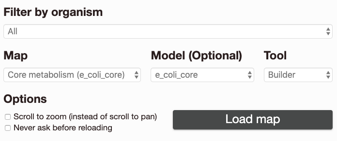
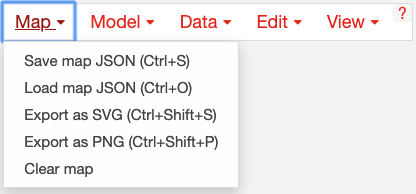
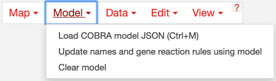
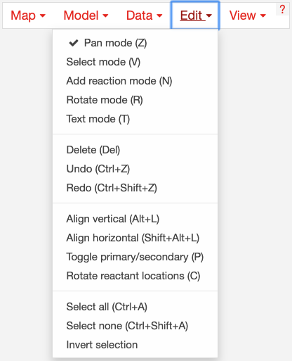
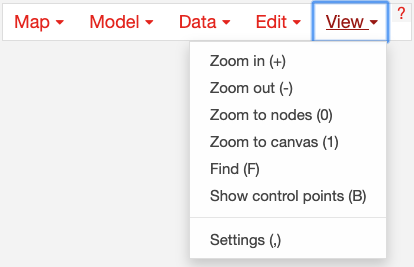
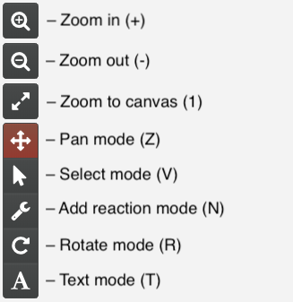
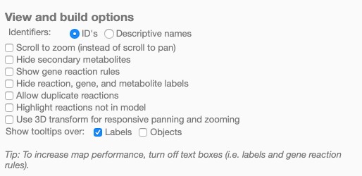

Getting Started
---------------

Introduction
============

**Escher** is here to help you visualize pathway maps. But, if you have never
heard of a pathway map, you might appreciate a quick introduction.

What are pathway maps?
^^^^^^^^^^^^^^^^^^^^^^

To understand pathway maps, it is useful to think about the general organization
of a cell. At the smallest level, molecules in a cell are arranged in
three-dimensional structures, and these structures determine many of the
functions that take place in a cell. For example, the 3D structure of an enzyme
determines the biochemical reactions that it can catalyze. These structures can
be visualized in 3D using tools like `Jmol`_ (as in this `example structure`_).

The DNA sequence is a second fundamental level of biological organization. DNA
sequences are the blueprints for all the machinery of the cell, and they can be
visualized as a one-dimensional series of bases (ATCG) using tools like the
`UCSC genome browser`_.

To use a football analogy, the 3D molecular structures are akin to the players
on the field, and the information in the DNA sequence is like the playbook on
the sidelines. But, football would not be very interesting if the players never
took to the field and executed those plays. So, we are missing this level of
detail: *the execution of biological plans by the molecular players*.

What we are missing is the biochemical reaction network. Proteins in the cell
catalyze the conversion of substrate molecules into product molecules, and these
*reactions* are responsible for generating energy, constructing cellular machinery
and structures, detecting molecules in the environment, signaling, and
more. Biochemical reactions can be grouped into pathways when they work in
concert to carry out a function. (If a reaction is a football play, then the
pathway is a `drive`_). And Escher can be used to visualize these reactions and
pathways. Together, we call these visualization **pathway maps**.

Escher to the rescue
^^^^^^^^^^^^^^^^^^^^

Many Escher maps represent *metabolic* pathways, and Escher was developed at the
`Systems Biology Research Group`_ where we have been building genome-scale
models of metabolism over the past fifteen years. However, Escher is not limited to
metabolism: It can be used to visualize any collection of biochemical reactions.

Escher includes one more killer feature: The ability to visualize datasets on a
pathway map. Many biological discoveries are enabled by collecting and analyzing
enormous datsets, and so biologists are grappling with the challenges of *big
data*. By visualizing data in the context of pathway maps, we can quickly spot
trends which would not be apparent with standard statistical tools. And Escher
visualizations can be adapted and shared to demonstrate those biological
discoveries.

The rest of this guide will introduce the Escher user interface and the major
features of Escher. You may also be interested in reading throught the
:doc:`tutorials` for a more hands-on introduction to using Escher.

The launch page
===============

When you open the Escher `website`_, you will see a launch page that looks like
this:

The options on the launch page are:
	   
- *Filter by organism:* Choose an organism to filter the Maps and Models.
- *Map:* Choose a pre-built map, or start from scratch with an empty builder by
  choosing *None*. In parentheses next to the map name, you will see the name of
  the model that was used to build this map. 
- *Model:* (Optional) If you choose a COBRA model to load, then you can add new
  reactions to the pathway map. You can also load your own model later, after
  you launch the tool. For an explanation of maps, models, and COBRA, see
  :doc:`escher_and_cobrapy`.
- *Tool:*

    - The *Viewer* allows you to pan and zoom the map, and to visualize data for
      reactions, genes, and metabolites.
    - The *Builder*, in addition to the Viewer features, allows you to add
      reactions, move and rotate existing reactions, add text annotations, and
      adjust the map canvas.

- *Options:*

    - *Scroll to zoom (instead of scroll to pan)*: Determines the effect of using
      the mouse's scroll wheel over the map.
    - *Never ask before reloading*: If this is checked, then you will not be
      warned before leaving the page, even if you have unsaved changes.

Choose *Load map* to open the Escher viewer or builder in a new tab, and
prepare to be delighted by your very own pathway map.

The menu bar
============

Once you have loaded an Escher map, you will see a menu bar along the top of the
screen. Click the question mark to bring up the Escher documentation: 

Loading and saving maps
=======================

Using the map menu, you can load and save maps at any time:

	   
Click *Save map JSON* to save the Escher map as a JSON file, which is the
standard file representing an Escher map. **NOTE**: The JSON file does NOT save any
datasets you have loaded. This may be changed in a future version of Escher.

Later, you can can load a JSON file to view and edit a map by clicking *Load map
JSON*.

Click *Export as SVG* to generate a `SVG`_ file for editing in tools like
`Adobe Illustrator`_ and `Inkscape`_. This is the best way to generate figures
for presentations and publications. Unlike a JSON file, a SVG file maintains the
data visualizations on the Escher map. However, you cannot load SVG files into
Escher after you generate them.

Click *Clear Map* to empty the whole map, leaving a blank canvas. **NOTE**: You
cannot undo *Clear Map*.

Loading models
==============

Use the model menu to manage the COBRA model loaded in Escher:

	   
Choose *Load COBRA model JSON* to open a COBRA model. Read more about COBRA
models in :doc:`escher_and_cobrapy`. Once you have COBRApy v0.3.0 or later
installed, then you can generate a JSON model by following this `example code`_.

Click *Clear Model* to clear the current model.

.. _loading-reaction-gene-and-metabolite-data:

Loading reaction, gene, and metabolite data
============================================

Datasets can be loaded as CSV files or JSON files, using the Data Menu.

.. image:: _static/data_menu.png

The structure of a CSV file
^^^^^^^^^^^^^^^^^^^^^^^^^^^

CSV files should have 1 header row, 1 ID column, and either 1 or 2 columns for
data values. Here is an example with a single data value columns::

    ID,time 0sec
    glc__D_c,5.4
    g6p__D_c,2.3

Which might look like this is Excel:    

========= =========
ID        time 0sec
========= =========
glc__D_c  5.4
g6p_c     2.3
========= =========
   
If two datasets are provided, then the Escher map will display the difference
between the datasets. In the Settings menu, the **Comparison** setting allows
you to choose between comparison functions (Fold Change, Log2(Fold Change), and
Difference). With two datasets, the CSV file looks like this:
 
========= ========= =========
ID        time 0sec time 5s
========= ========= =========
glc__D_c  5.4       10.2
g6p_c     2.3        8.1
========= ========= =========
    
Data can also be loaded from a JSON file. This Python code snippet provides an
example of generating the proper format for single reaction data values and for
reaction data comparisons::

    import json

    # save a single flux vector as JSON
    flux_dictionary = {'glc__D_c': 5.4, 'g6p_c': 2.3}
    with open('out.json', 'w') as f:
	json.dump(flux_dictionary, f) 

    # save a flux comparison as JSON 
    flux_comp = [{'glc__D_c': 5.4, 'g6p_c': 2.3}, {'glc__D_c': 10.2, 'g6p_c': 8.1}]
    with open('out_comp.json', 'w') as f: 
	json.dump(flux_comp, f)

.. _gene-reaction-rules:

Gene data and gene reaction rules
^^^^^^^^^^^^^^^^^^^^^^^^^^^^^^^^^

Escher uses *gene reaction rules* to connect gene data to the reactions on a
metabolic pathway. You can see these gene reaction rules on the map by selecting
*Show gene reaction rules* in the :ref:`settings` menu.
     
Gene reaction rules show the genes whose gene products are required to catalyze
a reaction. Gene are connected using AND and OR rules. AND rules are
used when two genes are required for enzymatic activity, e.g. they are members
of a protein complex. OR rules are used when either gene can catalyze the
enzymatic activity, e.g. they are isozymes.

With OR rules, Escher will take the sum of the data values for each gene. With
AND rules, Escher will either take the mean (the default) or the minimum of the
components. The AND behavior (mean vs. minimum) is defined in the
:ref:`settings` menu.
     
You can look through the :doc:`tutorials` to see gene reaction rules in action.

.. _editing-and-building:

Editing and building
====================

The Edit menu gives you access to function for editing the map:

	   
Escher has five major modes, and you can switch between those modes using the
buttons in the Edit menu, or using the buttons in the :ref:`button bar
<button-bar>` on the left of the screen.

View options
============

.. _button-bar:

The button bar
==============

The button bar give you quick access to many of the common Escher functions:

.. _settings:

Settings
========

- *Identifiers:* Choose whether to show BiGG IDs or descriptive names for
  reactions, metabolites, and genes.

- *Show gene reaction rules:* Show the gene reaction rules below the reaction
  labels, even gene data is not loaded.
  
- *Highlight reactions not in model:* Highlight in red any reactions that are on
  the map but are not in the model. This is useful when you are adapting a map
  from one model for use with another model
  
- *Allow duplicate reactions:* By default, duplicate reactions are hidden in the
  add reaction dropdown menu. However, you can turn this option on to show the
  duplicate reactions.

.. _`Jmol`: http://jmol.sourceforge.net/
.. _`example structure`: http://www.rcsb.org/pdb/explore/jmol.do?structureId=1J0X
.. _`UCSC Genome Browser`: http://genome.ucsc.edu/
.. _`Systems Biology Research Group`: http://systemsbiology.ucsd.edu/
.. _`website`: http://escher.github.io
.. _`drive`: http://youtu.be/wghznH7Jtbw?t=1m
.. _`SVG`: http://www.wikiwand.com/en/Scalable_Vector_Graphics
.. _`Adobe Illustrator`: http://www.adobe.com/products/illustrator.html
.. _`Inkscape`: https://inkscape.org/
.. _here: https://github.com/opencobra/cobrapy/releases
.. _`example code`: http://nbviewer.ipython.org/github/zakandrewking/escher/blob/master/docs/notebooks/Generate%20JSON%20models%20in%20COBRApy.ipynb 
