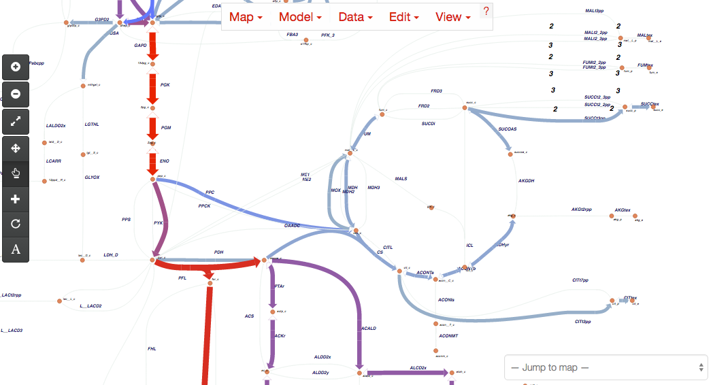

.. Escher documentation master file, created by sphinx-quickstart on Mon Nov 10
   13:25:01 2014.  You can adapt this file completely to your liking, but it
   should at least contain the root `toctree` directive.

Welcome to the documentation for **Escher**
===========================================

Escher is a web-based tool for building, viewing, and sharing visualizations of
biological pathways. These 'pathway maps' are a great way to contextualize
biological datasets. The easiest way to use Escher is to browse and build maps
on the `Escher website`_. New users may be interested in the
:doc:`getting_started` guide.

Help! I just upgraded to v1.0 and my maps will not load!
--------------------------------------------------------

If you have been using a pre-release version of Escher, you will need to convert
your maps to the v1.0 format by following these :doc:`directions <convert_maps>`.
After version 1.0, the map format will not change until version 2.0.

Features
--------

#. View pathway maps in any modern web browser
#. :ref:`Build maps <editing-and-building>` using the content of genome-scale metabolic models
#. :ref:`Visualize data <loading-reaction-gene-and-metabolite-data>` on
   reactions, genes, and metabolites
#. Full text search
#. Detailed options for changing colors, sizes, and more, all from the web
   browser
#. View maps :doc:`inside the IPython Notebook <ipython_notebook>`
#. :doc:`Embed maps <development>` within any website, with minimal dependencies
   (escher.js, d3.js, and optionally Twitter Bootstrap)

Supported browsers
------------------

We recommend using Google Chrome for optimal performance, but Escher will also
run in the latest versions of Firefox, Internet Explorer, and Safari (including
mobile Safari).

Installation
------------

Escher can be used without any installation by visiting the `Escher
website`_. However, you can install escher if you would like to (1) run Escher
offline, (2) include your own maps and models in the launch page, (3) view Escher maps
in an IPython Notebook, or (4) modify the source code. 

To install the latest stable version of Escher, run::

    pip install escher

For more information, see the documentation on :doc:`ipython_notebook` and
:doc:`development`.

Contents
--------

.. toctree::
   :maxdepth: 2
   :numbered:

   getting_started
   escher_and_cobrapy
   ipython_notebook
   convert_maps
   development
   contribute_maps
   javascript_api
   python_api
   
* :ref:`genindex`

License
-------

Escher is licensed under the `MIT license`_.

.. _`Escher website`: http://escher.github.io/
.. _`MIT license`: https://github.com/zakandrewking/escher/blob/master/LICENSE
